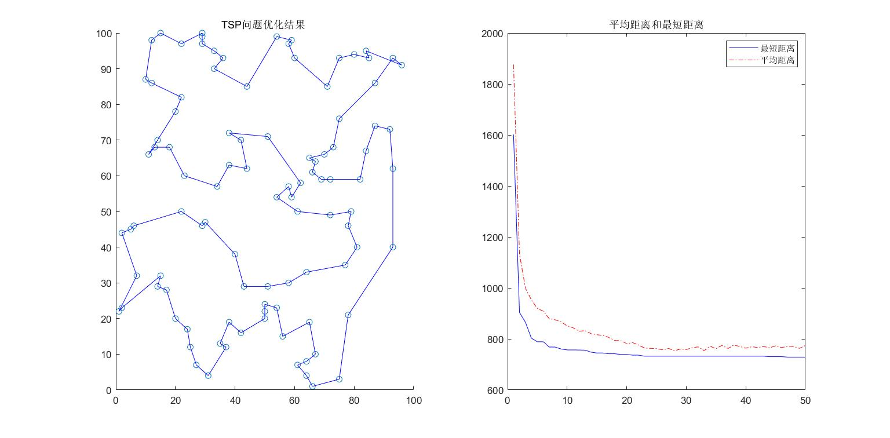

README
===========================

蚁群算法(ACO)用于求解旅行商(TSP)问题

## 目录
* [TSP问题描述](#TSP)
* [求解算法](#求解算法)
   * [蚂蚁系统(CA)](#CA)
   * [精英蚂蚁系统(ECA)](#ECA)

***

TSP
---
[问题描述及数学模型]https://en.wikipedia.org/wiki/Travelling_salesman_problem#cite_note-26

***
求解算法
---
CA
---
蚂蚁系统（colony system,CS）求解结果仿真图：
.jpg)

***
ECA
---
精英蚂蚁系统（elitism colony system,ECS）求解结果仿真图：

